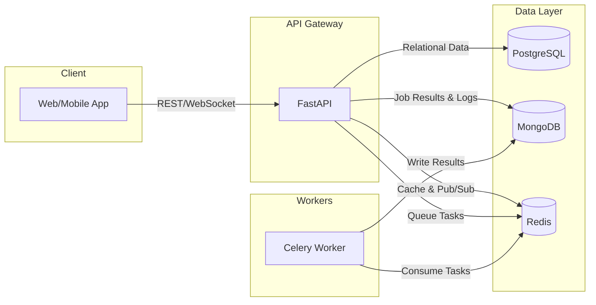

# Real-Time Collaborative Workspace Backend

A production-ready backend service for a real-time collaborative workspace, featuring secure authentication, project management, and async job processing with actual code execution.

---

## 🏗️ Architecture Overview



### Component Breakdown

| Component        | Technology   | Purpose                                                         |
| :--------------- | :----------- | :-------------------------------------------------------------- |
| **API**          | FastAPI      | Handles HTTP requests, WebSocket connections, input validation. |
| **Auth**         | JWT + Argon2 | Secure access/refresh tokens, password hashing.                 |
| **SQL Store**    | PostgreSQL   | Persistent storage for users, projects, workspaces, roles.      |
| **NoSQL Store**  | MongoDB      | High-velocity data: job results, activity logs, events.         |
| **Cache/Broker** | Redis        | API caching, rate limiting, Pub/Sub for real-time sync.         |
| **Workers**      | Celery       | Asynchronous task execution (e.g., code execution jobs).        |

---

## 🚀 Setup & Run Instructions

### Prerequisites

- Python 3.11+
- PostgreSQL, MongoDB, Redis (running locally or via Docker)

### Option 1: Local Development

```bash
# 1. Create and activate virtual environment
python -m venv venv
source venv/bin/activate  # Windows: venv\Scripts\activate

# 2. Install dependencies
pip install -r requirements.txt
pip install -r requirements-dev.txt

# 3. Configure environment
cp .env.example .env
# Edit .env with your database credentials

# 4. Run database migrations
alembic upgrade head

# 5. Start the API server (Terminal 1)
uvicorn app.main:app --reload

# 6. Start the Celery worker (Terminal 2)
celery -A app.workers.celery_app worker --loglevel=info
```

### Option 2: Docker Compose

```bash
cd docker
docker-compose up -d
```

### Accessing the API

- **Swagger UI**: http://localhost:8000/docs
- **ReDoc**: http://localhost:8000/redoc

---

## 📐 Design Decisions & Trade-offs

### 1. Dual Database Strategy (PostgreSQL + MongoDB)

- **Why**: Relational data (users, projects, roles) benefits from ACID transactions and strict schemas. Non-relational data (job results, activity streams) requires high write throughput and flexible schemas.
- **Trade-off**: Added operational complexity of managing two databases.

### 2. Argon2 for Password Hashing

- **Why**: Argon2 is the winner of the Password Hashing Competition, resistant to GPU attacks, and avoids bcrypt's 72-byte limit.
- **Trade-off**: Slightly higher CPU usage per hash operation.

### 3. Celery for Async Jobs

- **Why**: Decouples long-running tasks (like code execution) from the request-response cycle, improving API responsiveness.
- **Trade-off**: Introduces Redis as a required dependency and adds deployment complexity.

### 4. JWT Authentication with Refresh Tokens

- **Why**: Stateless access tokens allow horizontal scaling of the API. Refresh tokens (stored in Redis) allow session invalidation.
- **Trade-off**: Requires careful handling of token expiry and refresh logic on the client.

### 5. WebSocket + Redis Pub/Sub for Real-Time Sync

- **Why**: Enables broadcasting of user cursors and document changes across multiple API instances.
- **Trade-off**: Redis becomes a central point of coordination; must be highly available.

---

## 📈 Scalability Considerations

### Horizontal Scaling

| Component          | Scaling Strategy                                                                          |
| :----------------- | :---------------------------------------------------------------------------------------- |
| **FastAPI**        | Deploy multiple instances behind a load balancer. All state lives in external stores.     |
| **Celery Workers** | Add more worker processes or pods. Use task routing to dedicated `code_execution` queues. |
| **PostgreSQL**     | Use read replicas for scaling reads. Consider connection pooling (e.g., PgBouncer).       |
| **MongoDB**        | Use sharding for write scaling. Replica sets for read scaling and availability.           |
| **Redis**          | Use Redis Cluster for high availability and scaling.                                      |

### Performance Optimizations

- **Rate Limiting**: A sliding-window rate limiter protects endpoints from abuse.
- **Caching**: Redis is used to cache frequently accessed data like user profiles.
- **Connection Pooling**: SQLAlchemy's async session pool efficiently manages DB connections.
- **Idempotent Jobs**: Job processing uses unique IDs to prevent duplicate work.

### Future Enhancements

- **Code Execution Sandboxing**: The current `subprocess` execution is for development only. Production requires Docker, Firecracker VMs, or gVisor for security.
- **Observability**: Integrate OpenTelemetry for distributed tracing across the API and workers.
- **Kubernetes Deployment**: Use Helm charts for managing deployments, scaling, and secrets.

---

## 🧪 Testing

```bash
# Run all integration tests
pytest tests/integration

# Run with coverage report
pytest --cov=app --cov-report=term-missing

# Current Status: 36 tests passing
```

---

## 📂 Project Structure

```
app/
├── api/v1/           # Versioned API endpoints
├── core/             # Security, permissions, rate limiting
├── models/           # SQLAlchemy (SQL) & Pydantic (NoSQL) models
├── schemas/          # Request/Response validation schemas
├── db/               # Database connection utilities
├── websocket/        # Real-time collaboration manager
└── workers/          # Celery task definitions
```

---

## 📄 License

MIT
